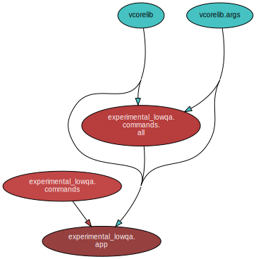

<!--
    =====================================
    generator=datazen
    version=3.1.4
    hash=82c7ff5f1198788a93c3f711bb428740
    =====================================
-->

# experimental-lowqa ([0.1.4](https://pypi.org/project/experimental-lowqa/))

*Read the sign.*

## Documentation

### Generated

* By [sphinx-apidoc](https://vkottler.github.io/python/sphinx/experimental-lowqa)
(What's [`sphinx-apidoc`](https://www.sphinx-doc.org/en/master/man/sphinx-apidoc.html)?)
* By [pydoc](https://vkottler.github.io/python/pydoc/experimental_lowqa.html)
(What's [`pydoc`](https://docs.python.org/3/library/pydoc.html)?)

## Python Version Support

This package is tested with the following Python minor versions:

* [`python3.12`](https://docs.python.org/3.12/)
* [`python3.13`](https://docs.python.org/3.13/)

## Platform Support

This package is tested on the following platforms:

* `ubuntu-latest`
* `macos-latest`
* `windows-latest`

# Introduction

This project does not require 100% unit test coverage for publishing (hence
the name). **All other typical Python quality assurance is still enforced.**

# Internal Dependency Graph

A coarse view of the internal structure and scale of
`experimental-lowqa`'s source.
Generated using [pydeps](https://github.com/thebjorn/pydeps) (via
`mk python-deps`).

